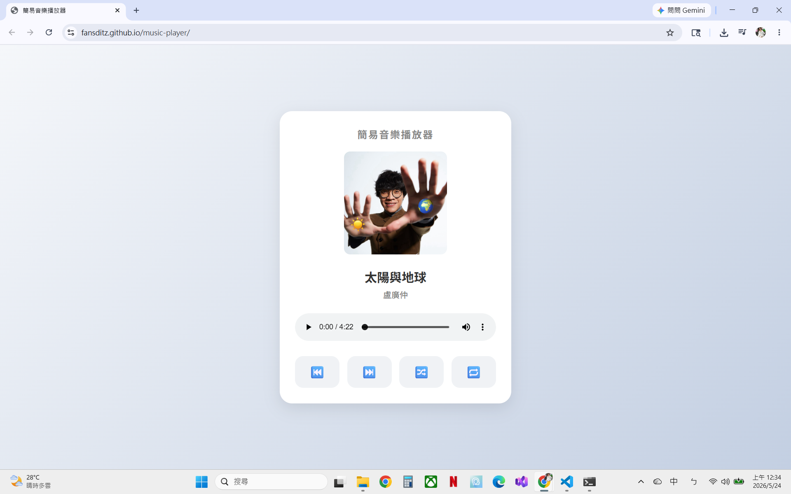

# 簡易音樂播放器

> 這是一個使用 HTML、CSS、JavaScript 製作的音樂播放器。

## 畫面預覽

## Live Demo
🔗 點擊下方連結即可使用：
https://fansditz.github.io/music-player/

## 專案目的
> 練習前端互動功能，並實作音樂播放器的播放控制與畫面切換。

## 使用技術
- HTML
- CSS
- JavaScript

## 功能
- 顯示歌曲資訊與封面
- 播放 / 暫停音樂
- 音量與播放速度調整
- 上下首切換
- 播放模式切換（隨機 / 重複）

## 開發過程中遇到的問題
- GitHub Pages 部署後音樂檔案無法正常讀取
- 響應式設計問題
- .active 與 :active 的效果差異

## 未來規劃
- 播放清單
- 歷史播放紀錄
- 歌詞
